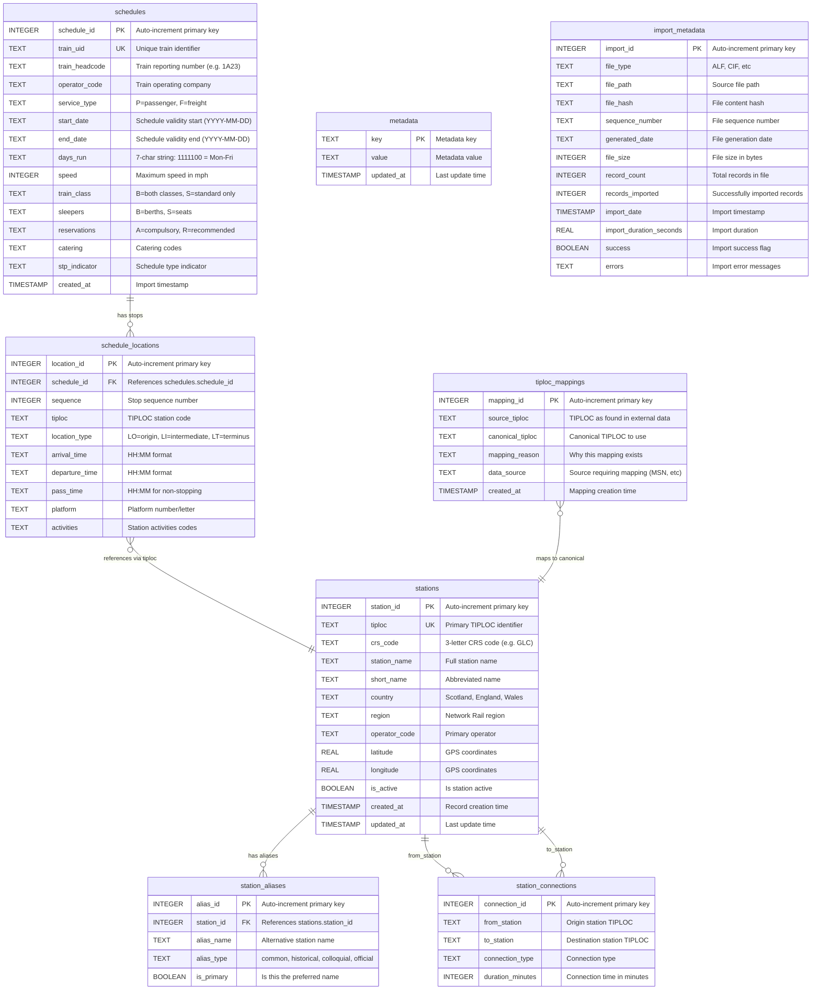
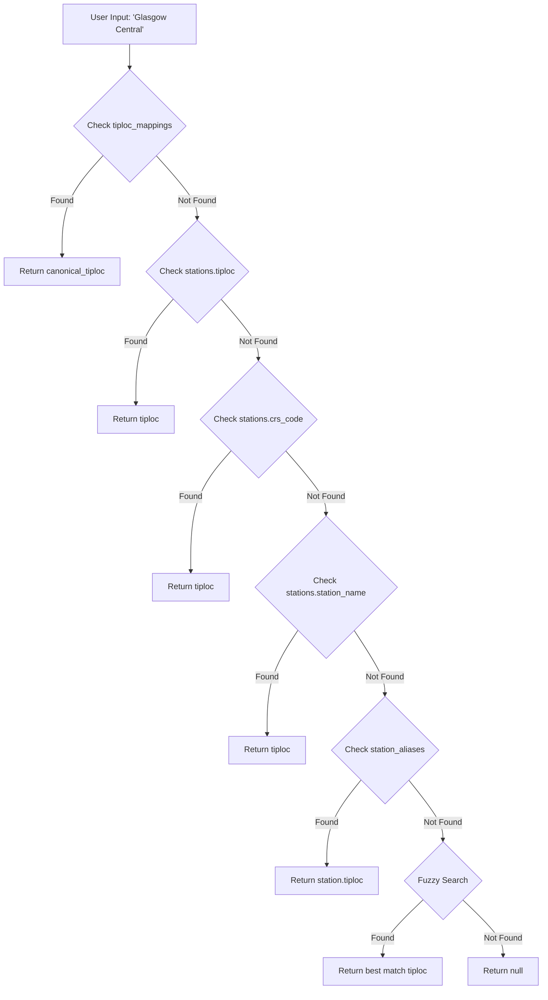
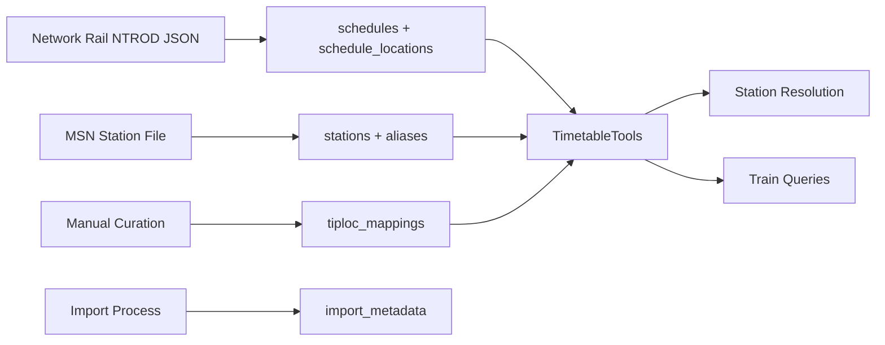

# Database Schema Diagram

## Timetable Database Architecture

## Key Relationships and Data Flow

### Core Timetable Data
- **schedules** ↔ **schedule_locations**: One-to-many relationship defining train routes
- Each schedule has multiple locations (stops) in sequence order
- **schedule_locations.tiploc** references station codes but no formal FK (performance)

### Station Reference System
- **stations**: Master station registry with canonical TIPLOCs
- **station_aliases**: Multiple names per station (official, common, historical)
- **tiploc_mappings**: Handles data source inconsistencies (MSN vs CIF formats)

### Data Quality & Metadata
- **import_metadata**: Tracks all file imports with success/failure details
- **metadata**: System-wide configuration and statistics
- **station_connections**: Future use for journey planning (currently empty)

## Station Resolution Flow

## Database Statistics (Current)

| Table | Records | Purpose |
|-------|---------|---------|
| **schedules** | 581,945 | Train service definitions |
| **schedule_locations** | 9,966,849 | Individual train stops |
| **stations** | 33 | Scottish station registry |
| **station_aliases** | 15+ | Alternative station names |
| **tiploc_mappings** | 2 | Data consistency fixes |
| **import_metadata** | 9 | File import tracking |
| **metadata** | 4 | System configuration |

## Index Strategy

**Performance Indexes:**
- `stations.tiploc` - Primary station lookups
- `stations.crs_code` - CRS code resolution  
- `stations.station_name` - Name-based searches
- `station_aliases.alias_name` - Alias resolution
- `tiploc_mappings.source_tiploc` - Data mapping lookups

**Query Optimization:**
- No foreign keys between `schedule_locations` and `stations` for performance
- Logical relationships maintained through application code
- TIPLOC-based lookups optimized for high-frequency operations

## Data Sources Integration

